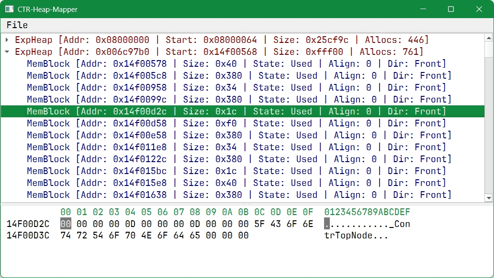

# CTR-Heap-Mapper

**CTR-Heap-Mapper** is a lightweight Qt-based visualization tool designed to explore and analyze the memory structure (
Heap) of Nintendo 3DS games.

## 🔍 Overview

The tool parses RAM dumps to reconstruct the hierarchy of the standard 3DS memory allocator (**ExpHeap**). Key features
include:

* **Tree View Visualization**: Displays the full heap hierarchy (Parent, SubHeaps, Siblings) in an easy-to-navigate
  tree.
* **Block Inspection**: Lists all memory blocks (Used/Free) with their address, size, alignment, and allocation
  direction (Front/Rear).
* **Integrated Hex Viewer**: Click on any heap or memory block to instantly view its raw content in the built-in hex
  editor.
* **Multi-Region Support**: Handles dump files containing multiple memory regions (Gateway RAM Dump format).

## 🚀 Getting Started

### Data Import

1. **Dumping RAM**: Use **CTRPluginFramework** on your console to perform a full RAM dump while the game is running.
2. **Importing**: Use the `Ctrl + O` shortcut (or *File > Open*) to load your `.bin` file.
3. **Examples**: Sample dumps for *Ice Station Z* and *Inazuma Eleven Go Galaxy* are available in the `assets/` folder
   for testing.

### Build (Windows + CLion + Qt)

1. Clone the repository: `git clone https://github.com/your-username/CTR-Heap-Mapper.git`
2. Open the project in **CLion**.
3. Ensure your CMake profile is configured to point to your **Qt6** installation.
4. Build & Run.

## ⚠️ Compatibility Notes

* **Pokémon XY / ORAS**: These titles manage memory differently, using a specific heap structure that wraps the ExpHeap
  with a resource management table. An improved version specifically for these games is planned.
* **General**: This tool is designed to work with most titles using the `ExpHeap` system. If a game does not display
  correctly, please feel free to reach out.

## 🛠️ Technical Details

The parsing engine searches for the `HPXE` signature (0x45585048) starting from the base address (`0x08000000`). It
recursively traverses:

* **Siblings**: Side-by-side heaps via `next`/`prev` pointers.
* **SubHeaps**: Nested heaps located within allocated blocks.
* **MemoryBlockHeaders**: Differentiates between `Used` (signature `DU` / 0x5544) and `Free` (signature `RF` / 0x4652)
  states.

---

### Contact & Support

If you encounter any issues or wish to suggest improvements regarding data structures, please open an Issue or contact
me directly!